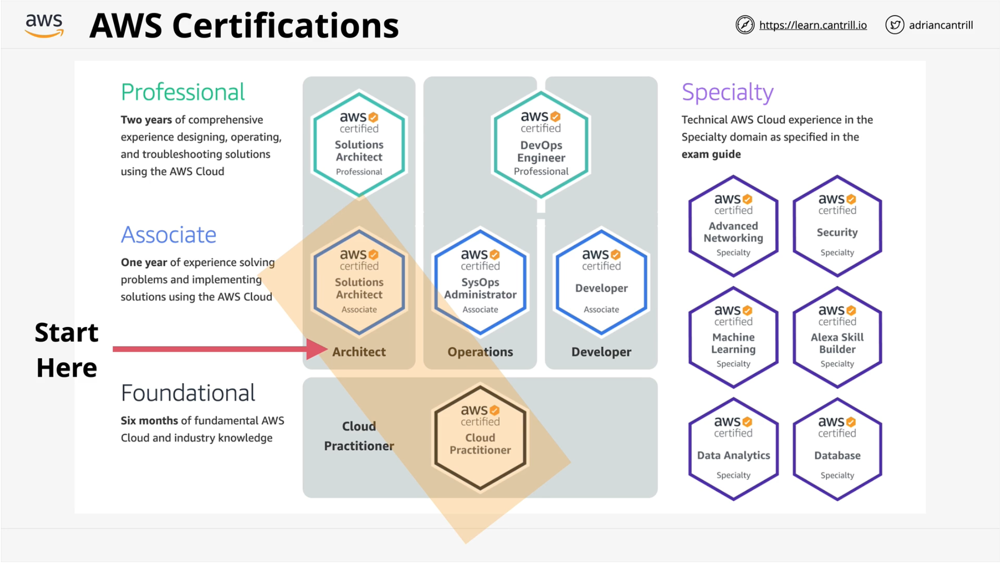
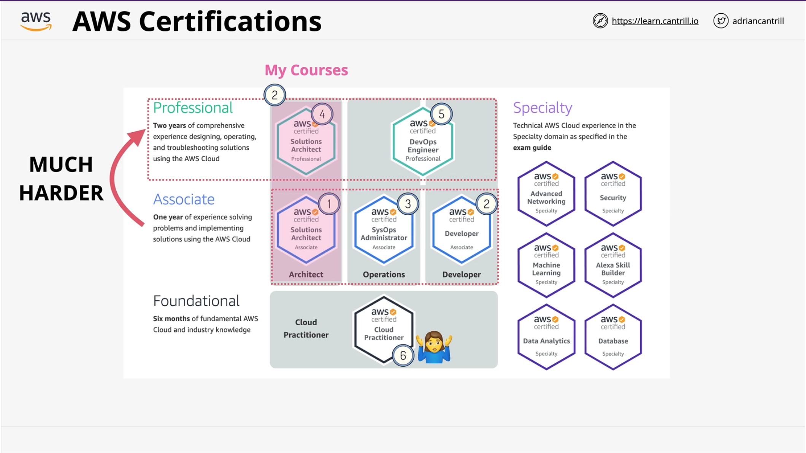
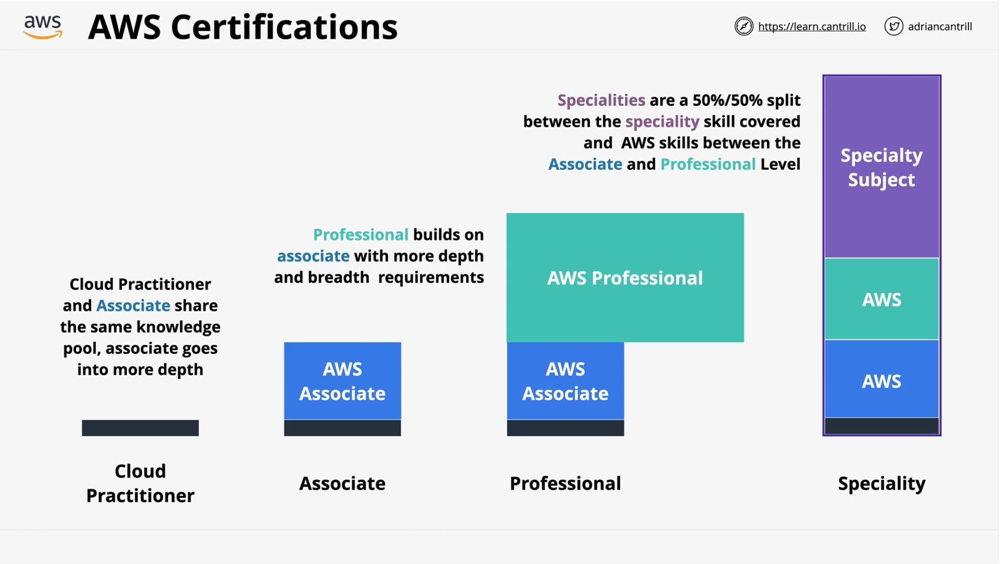

# AWS Exams

Start with AWS Solutions Architect Associate instead of Cloud Practitioner because of duplicate in study contents

It recommend to do Developer Associate after Solution Associate, SysOps Administrator Associate

Questions at the associate level tend to be between one line and two to three lines and then you generally have four or five answers each of one line each.

Questions at the professional level tend to be four to five lines, there are four to five answers and each of the answers ranges from two to four lines.

AWS Certifications [https://aws.amazon.com/certification/](https://aws.amazon.com/certification/)

## Cloud Practitioner

[https://aws.amazon.com/certification/certified-cloud-practitioner/](https://aws.amazon.com/certification/certified-cloud-practitioner/)

[https://d1.awsstatic.com/training-and-certification/docs-cloud-practitioner/AWS-Certified-Cloud-Practitioner_Exam-Guide.pdf](https://d1.awsstatic.com/training-and-certification/docs-cloud-practitioner/AWS-Certified-Cloud-Practitioner_Exam-Guide.pdf)

[https://d1.awsstatic.com/training-and-certification/docs-cloud-practitioner/AWS-Certified-Cloud-Practitioner_Sample-Questions.pdf](https://d1.awsstatic.com/training-and-certification/docs-cloud-practitioner/AWS-Certified-Cloud-Practitioner_Sample-Questions.pdf)

## Architect - Associate

[https://aws.amazon.com/certification/certified-solutions-architect-associate/](https://aws.amazon.com/certification/certified-solutions-architect-associate/)

[https://d1.awsstatic.com/training-and-certification/docs-sa-assoc/AWS-Certified-Solutions-Architect-Associate_Exam-Guide.pdf](https://d1.awsstatic.com/training-and-certification/docs-sa-assoc/AWS-Certified-Solutions-Architect-Associate_Exam-Guide.pdf)

[https://d1.awsstatic.com/training-and-certification/docs-sa-assoc/AWS-Certified-Solutions-Architect-Associate_Sample-Questions.pdf](https://d1.awsstatic.com/training-and-certification/docs-sa-assoc/AWS-Certified-Solutions-Architect-Associate_Sample-Questions.pdf)

## Developer - Associate

[https://aws.amazon.com/certification/certified-developer-associate/](https://aws.amazon.com/certification/certified-developer-associate/)

[https://d1.awsstatic.com/training-and-certification/docs-dev-associate/AWS-Certified-Developer-Associate_Exam-Guide.pdf](https://d1.awsstatic.com/training-and-certification/docs-dev-associate/AWS-Certified-Developer-Associate_Exam-Guide.pdf)

[https://d1.awsstatic.com/training-and-certification/docs-dev-associate/AWS-Certified-Developer-Associate_Sample-Questions.pdf](https://d1.awsstatic.com/training-and-certification/docs-dev-associate/AWS-Certified-Developer-Associate_Sample-Questions.pdf)

## SysOps - Associate

[https://aws.amazon.com/certification/certified-sysops-admin-associate/](https://aws.amazon.com/certification/certified-sysops-admin-associate/)

[https://d1.awsstatic.com/training-and-certification/docs-sysops-associate/AWS-Certified-SysOps-Administrator-Associate_Exam-Guide.pdf](https://d1.awsstatic.com/training-and-certification/docs-sysops-associate/AWS-Certified-SysOps-Administrator-Associate_Exam-Guide.pdf)

[https://d1.awsstatic.com/training-and-certification/docs-sysops-associate/AWS-Certified-SysOps-Administrator-Associate_Sample-Questions.pdf](https://d1.awsstatic.com/training-and-certification/docs-sysops-associate/AWS-Certified-SysOps-Administrator-Associate_Sample-Questions.pdf)

## Architect - Professional

[https://aws.amazon.com/certification/certified-solutions-architect-professional/](https://aws.amazon.com/certification/certified-solutions-architect-professional/)

[https://d1.awsstatic.com/training-and-certification/docs-sa-pro/AWS-Certified-Solutions-Architect-Professional_Exam-Guide.pdf](https://d1.awsstatic.com/training-and-certification/docs-sa-pro/AWS-Certified-Solutions-Architect-Professional_Exam-Guide.pdf)

[https://d1.awsstatic.com/training-and-certification/docs-sa-pro/AWS-Certified-Solutions-Architect-Professional_Sample-Questions.pdf](https://d1.awsstatic.com/training-and-certification/docs-sa-pro/AWS-Certified-Solutions-Architect-Professional_Sample-Questions.pdf)

## Devops - Professional

[https://aws.amazon.com/certification/certified-devops-engineer-professional/](https://aws.amazon.com/certification/certified-devops-engineer-professional/)

[https://d1.awsstatic.com/training-and-certification/docs-devops-pro/AWS-Certified-DevOps-Engineer-Professional_Exam-Guide.pdf](https://d1.awsstatic.com/training-and-certification/docs-devops-pro/AWS-Certified-DevOps-Engineer-Professional_Exam-Guide.pdf)

[https://d1.awsstatic.com/training-and-certification/docs-devops-pro/AWS-Certified-DevOps-Engineer-Professional_Sample-Questions.pdf](https://d1.awsstatic.com/training-and-certification/docs-devops-pro/AWS-Certified-DevOps-Engineer-Professional_Sample-Questions.pdf)

## Advanced Networking - Speciality

[https://aws.amazon.com/certification/certified-advanced-networking-specialty/](https://aws.amazon.com/certification/certified-advanced-networking-specialty/)

[https://d1.awsstatic.com/training-and-certification/docs-advnetworking-spec/AWS-Certified-Advanced-Networking-Specialty_Exam-Guide.pdf](https://d1.awsstatic.com/training-and-certification/docs-advnetworking-spec/AWS-Certified-Advanced-Networking-Specialty_Exam-Guide.pdf)

[https://d1.awsstatic.com/training-and-certification/docs-advnetworking-spec/AWS-Certified-Advanced-Networking-Specialty_Sample-Questions.pdf](https://d1.awsstatic.com/training-and-certification/docs-advnetworking-spec/AWS-Certified-Advanced-Networking-Specialty_Sample-Questions.pdf)

## Security - Specialty

[https://aws.amazon.com/certification/certified-security-specialty/](https://aws.amazon.com/certification/certified-security-specialty/)

[https://d1.awsstatic.com/training-and-certification/docs-security-spec/AWS-Certified-Security-Specialty_Exam-Guide.pdf](https://d1.awsstatic.com/training-and-certification/docs-security-spec/AWS-Certified-Security-Specialty_Exam-Guide.pdf)

[https://d1.awsstatic.com/training-and-certification/docs-security-spec/AWS-Certified-Security-Speciality_Sample-Questions.pdf](https://d1.awsstatic.com/training-and-certification/docs-security-spec/AWS-Certified-Security-Speciality_Sample-Questions.pdf)

## Machine Learning - Specialty

[https://aws.amazon.com/certification/certified-machine-learning-specialty/](https://aws.amazon.com/certification/certified-machine-learning-specialty/)

[https://d1.awsstatic.com/training-and-certification/docs-ml/AWS-Certified-Machine-Learning-Specialty_Exam-Guide.pdf](https://d1.awsstatic.com/training-and-certification/docs-ml/AWS-Certified-Machine-Learning-Specialty_Exam-Guide.pdf)

[https://d1.awsstatic.com/training-and-certification/docs-ml/AWS-Certified-Machine-Learning-Specialty_Sample-Questions.pdf](https://d1.awsstatic.com/training-and-certification/docs-ml/AWS-Certified-Machine-Learning-Specialty_Sample-Questions.pdf)

## Alexa - Specialty

[https://aws.amazon.com/certification/certified-alexa-skill-builder-specialty/](https://aws.amazon.com/certification/certified-alexa-skill-builder-specialty/)

[https://d1.awsstatic.com/training-and-certification/docs-alexa-skill-builder-specialty/AWS-Certified-Alexa-Skill-Builder-Specialty_Exam-Guide.pdf](https://d1.awsstatic.com/training-and-certification/docs-alexa-skill-builder-specialty/AWS-Certified-Alexa-Skill-Builder-Specialty_Exam-Guide.pdf)

[https://d1.awsstatic.com/training-and-certification/docs-alexa-skill-builder-specialty/AWS-Certified-Alexa-Skill-Builder-Specialty_Sample-Questions.pdf](https://d1.awsstatic.com/training-and-certification/docs-alexa-skill-builder-specialty/AWS-Certified-Alexa-Skill-Builder-Specialty_Sample-Questions.pdf)

## Data Analytics - Specialty

[https://aws.amazon.com/certification/certified-data-analytics-specialty/](https://aws.amazon.com/certification/certified-data-analytics-specialty/)

[https://d1.awsstatic.com/training-and-certification/docs-data-analytics-specialty/AWS-Certified-Data-Analytics-Specialty_Exam-Guide.pdf](https://d1.awsstatic.com/training-and-certification/docs-data-analytics-specialty/AWS-Certified-Data-Analytics-Specialty_Exam-Guide.pdf)

[https://d1.awsstatic.com/training-and-certification/docs-data-analytics-specialty/AWS-Certified-Data-Analytics-Specialty_Sample-Questions.pdf](https://d1.awsstatic.com/training-and-certification/docs-data-analytics-specialty/AWS-Certified-Data-Analytics-Specialty_Sample-Questions.pdf)

## Database - Speciality

[https://aws.amazon.com/certification/certified-database-specialty/](https://aws.amazon.com/certification/certified-database-specialty/)

[https://d1.awsstatic.com/training-and-certification/docs-database-specialty/AWS-Certified-Database-Specialty_Exam-Guide.pdf](https://d1.awsstatic.com/training-and-certification/docs-database-specialty/AWS-Certified-Database-Specialty_Exam-Guide.pdf)

[https://d1.awsstatic.com/training-and-certification/docs-database-specialty/AWS-Certified-Database-Specialty_Sample-Questions.pdf](https://d1.awsstatic.com/training-and-certification/docs-database-specialty/AWS-Certified-Database-Specialty_Sample-Questions.pdf)