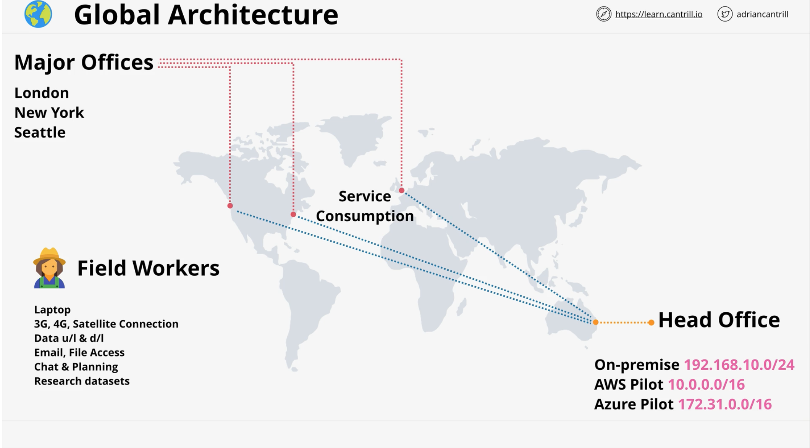

# Scenario

[Animals4life.org](http://animals4life.org/) is the scenario used throughout the course as a real-world like situation to explain theory and demonstrate practical examples.

This lesson will step you through the scenario and explain the key business issues and requirements.

The organisation is fictitious and any resemblance to any real organisations is coincidental and unintended.

## About Animals4life:

- Animal Rescue and Awareness Organization
- Global, with HQ in Brisbane Australia - 100 staffs
- Call center, Admin, IT, Marketing, Legal & Accounts
- ~100 Remote workers across Australia and Globally
- Staff are mixture (animal care, activists, lobbyists…)
- Major offices in London, New York, Seattle

## About Animals4life Infrastructure:

- Is a mess
- Small on-premises datacenter in Brisbane. The DC is old and the company who manages them is encouraging customers to migrate out as soon as possible
- Badly Implemented AWS trial in SYD Region
- A few isolated Azure/GCP Pilots
- Global Offices & mobile staff utilize Brisbane Infrastructure
- Cost-conscious but progressive management team

## Current Problem

- Legacy on-premises hardware is failing
- AWS/Azure Pilots are messy and not best practice
- Performance issue for field workers
- Lack of HA and Scability - hardware is expensive
- Staff skills/capability struggle, little automation
- Global expansion concern - cost for new infrastructure

## Idea Outcomes

- Fast performance for all field workers
- Able to deploy into new regions quickly when required
- Low cost & scalable base infrastructure
- Agility - spin up new marketing campaigns, social and progressive applications (IoT, BigData etc…)
- Automation - low base staffing costs