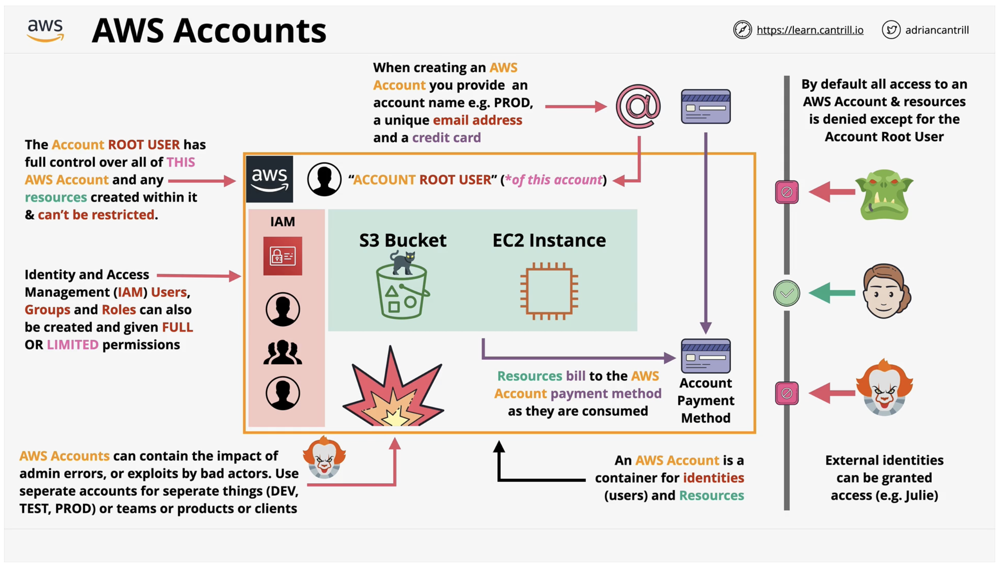

# AWS Account - The Basics

AWS Account is a container for identities (users) and resources

When creating an AWS Account, you provide an account name, a unique email address and a credit card (same credit card can be used for multiple AWS accounts but email address can’t)

The email address using to create the account will be used to create a special type of identity within AWS account which is known as the Account Root user → every AWS account have account root user

Account root user has full control over that one specific AWS account and any resources created within it and CAN NOT BE RESTRICTED

Resources bill to the AWS Account payment method (credit card) as they are consumed. Generally, AWS is pay as you go platform, so if you use a service for 2 minutes then you will only pay for 2 minutes of that service 

You can create additional identites inside the AWS account which can be restricted using a service called Identity and Access Management (IAM). Users, Groups and Roles can also be created and given FULL or Limited permissions

Except account Root user, any IAM identity starts off with NO permission, you have to explicitly grant permissions to any identities managed by the IAM service

The orange line is account boundaries, think it like a wall, it can keep things inside the account from getting out and also keep things outside the account from getting in

AWS account is really good at containing any damaged caused within those accounts, so things such as an inexperienced system administrator doing something silly or a bad actor attempting to intentionally harm your account or if the credentials for the account root user are leaked then these could be used to delete everything inside that one specific AWS account. So if your entire business runs from that one single account then this can be really really bad. However, if you create separate AWS Accounts for different uses, maybe a development account, a test account, a production account then you can limit damages to that one specific AWS account

By default, all access to AWS Account & resource is denied except for the account root user

How do I create and activate a new AWS account? → [https://aws.amazon.com/premiumsupport/knowledge-center/create-and-activate-aws-account/](https://aws.amazon.com/premiumsupport/knowledge-center/create-and-activate-aws-account/)
