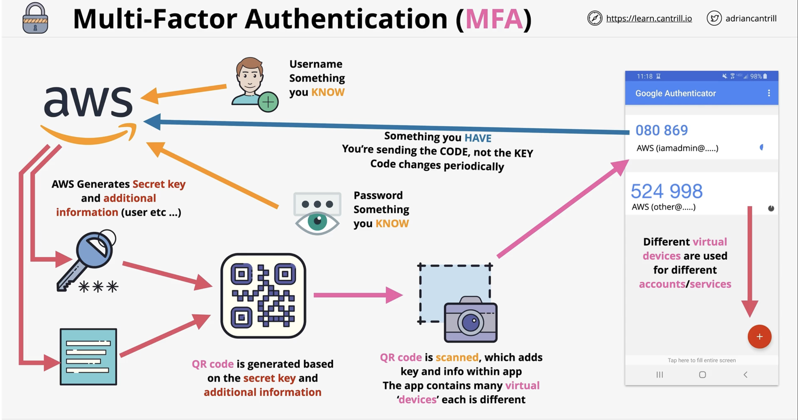

# Multi-factor authentication

- Usernames and Passwords if leaked, anyone can be you
- Factors is different pieces of evidence which prove identity
    - Knowledge - Something you know, usernames, password (is one type of factor)
    - Possession - Something you have, bank card, MFA device/app (second type of factor)
    - Inherent - Something you are, like fingerprint, face, voice, iris (third type of factor)
    - Location - A location (physical), which network (corporate, wifi etc...)
- More factors means more security and harder to fake
